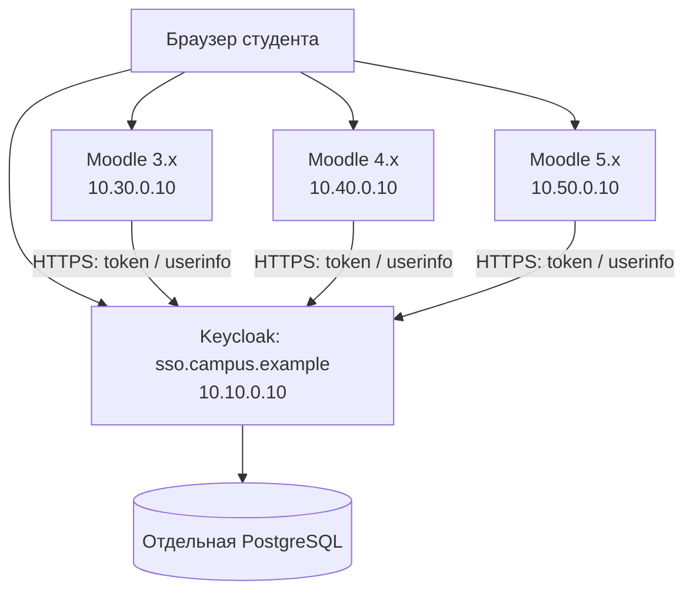

# Варианты единой учётной записи

## Исходные условия и выбор

Есть Moodle поколений 3, 4, 5 в разных подсетях общей сети. Точные релизы и
адреса ещё не установлены; Active Directory отсутствует. Предлагаемый вариант:
один независимый Keycloak как источник пользователей, каждый Moodle — отдельный
клиент. В дальнейшем каталог LDAP можно подключить к Keycloak без смены общей схемы.

| Вариант | Что получает студент | Затраты и ограничения | Решение для проекта |
|---|---|---|---|
| Keycloak + встроенный OAuth 2 Moodle | Один центральный логин, повторный вход через сессию Keycloak | Нужны HTTPS, доступный IdP и настройка каждого Moodle | Базовый вариант, реализован комплект конфигурации |
| Keycloak + OIDC/SAML-плагин | Центральный вход, возможности выбранного плагина | Отдельные версии плагина под каждый Moodle; другие callback и параметры | Рассмотреть при требованиях к logout, группам или совместимости |
| LDAP напрямую из каждого Moodle | Общий логин и пароль | Сам по себе LDAP не даёт браузерный SSO; каталог нужно создать и обслуживать | Уместно при наличии организационного LDAP, сейчас его нет |
| MNet | Переход между доверенными Moodle от «домашнего» сервера | Зависимость от Moodle и XML-RPC, больше связей между серверами | Возможный переходный вариант после проверки конкретных релизов |
| Одна общая таблица пользователей/БД | Кажущаяся общность аккаунтов | Разные схемы, обновления и внешние ключи; риск потери связей с оценками | Не использовать |

Moodle документирует OAuth 2 services начиная с 3.3 и discovery для OIDC.
Это основание для выбора стандартной интеграции, а не гарантия совместимости
любой старой сборки с текущим Keycloak. [Moodle OAuth 2 services](https://docs.moodle.org/311/en/OAuth_2_services).
У `auth_oidc` есть отдельные релизы под версии Moodle: нельзя установить один
произвольный архив на все серверы. [Версии плагина](https://moodle.org/plugins/auth_oidc/versions).
LDAP и MNet — самостоятельные альтернативы, их конфигурации в этот комплект
не входят. [LDAP](https://docs.moodle.org/405/en/LDAP_authentication),
[MNet](https://docs.moodle.org/311/en/MNet).

## Один аккаунт и локальные записи

Единая учётная запись означает одно место создания студента, один пароль и
одну центральную идентичность. Moodle всё равно хранит локальный `user.id`,
на который ссылаются зачисления, попытки тестов, оценки и журналы. Новому студенту
не нужно регистрироваться повторно: локальная запись создаётся при первом входе.
Старую запись необходимо привязать, сохранив её идентификатор.
[Поведение OAuth 2 authentication](https://docs.moodle.org/405/en/OAuth_2_authentication).

В этой реализации внешнее поле `sub` сопоставляется с `username` OAuth-сервиса
Moodle. Оно служит стабильным ключом внешней привязки; не следует менять это
сопоставление после подключения пользователей. ФИО и email — атрибуты профиля,
а не надёжный постоянный ключ. Внутренний логин существующего Moodle может
сохраниться прежним после привязки. Смена email и имени проверяется на пилоте.
Создавать заново realm или пользователя Keycloak вместо восстановления нельзя:
новый `sub` нарушит прежние привязки.

## Сеть

Адреса — примеры. Пользовательские компьютеры должны видеть и Moodle, и Keycloak;
каждый контейнер Moodle должен видеть Keycloak по тому же каноническому имени.
Общая большая сеть не означает автоматической маршрутизации между VLAN: нужны
маршруты и ACL на сетевом оборудовании. Docker bridge не связывает удалённые хосты.

| Источник | Назначение | Разрешённый трафик |
|---|---|---|
| Подсети студентов | Каждый разрешённый Moodle и Keycloak | TCP 443 либо явно выбранный HTTPS-порт |
| Контейнеры/серверы Moodle | Keycloak | TCP 443, discovery/token/userinfo |
| Серверы и клиенты | Внутренние DNS и NTP | По политике инфраструктуры |
| Keycloak | PostgreSQL | TCP 5432 внутри отдельной Docker-сети |
| Keycloak / Moodle | Внутренний SMTP, если используется | Порт и TLS по настройке SMTP |

Базы Moodle не публикуются для SSO; межсерверный доступ Moodle→Moodle для
аутентификации не требуется. Используйте отдельные базы и `moodledata` для каждого
сайта. Корневой Dockerfile предназначен для исходного Moodle 5.2: нельзя просто
сменить ветку на 3.x, оставив тот же PHP, MariaDB и Apache document root.

Лучше использовать внутренний DNS над реальными IP. Работа непосредственно по
IP также возможна при HTTPS-сертификатах с соответствующим IP SAN; `wwwroot` и
redirect URI должны совпадать. В шаблоне поддержан IPv4. Пример `.example`
не разрешается сам: замените его внутренними именами и настройте DNS.

## Границы решения

SSO объединяет вход, но не курсы, роли, оценки, лицензии и зачисления. В первой
версии каталог сайтов — реестр `sites.json` и список настроек. Ссылки на сайты
можно разместить на главной странице Moodle; единого интерфейса оценок здесь нет.
Если нужен общий каталог курсов, это отдельный слой через API с ограниченными
правами после запуска SSO.

Отключение студента в Keycloak запрещает новые центральные входы, но не обязано
немедленно завершать уже активные Moodle-сессии. Для срочного отзыва доступа
нужны приостановка локальных аккаунтов и завершение сессий на всех Moodle.
Единый logout не заявлен для встроенного OAuth 2: его проверяют отдельно.

Один Keycloak — точка отказа новых входов. Для пилота достаточно одного узла;
для эксплуатации нужны мониторинг HTTPS/discovery, резервные копии PostgreSQL
и проверенное восстановление. Кластер и отказоустойчивость БД планируются по RTO/RPO,
не создаются этим Compose. Без интернета SSO работает, если доступны внутренние
маршруты, DNS, время, CA и необходимые сервисы восстановления доступа.
